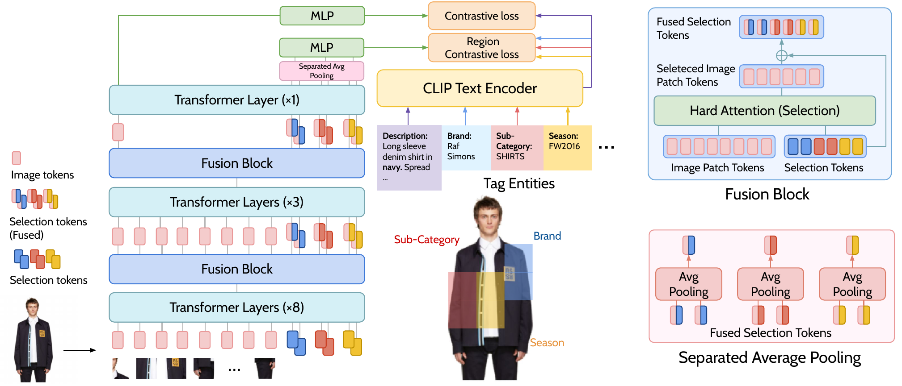
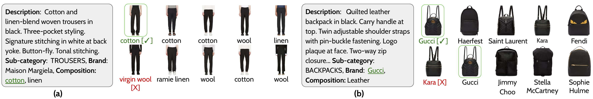
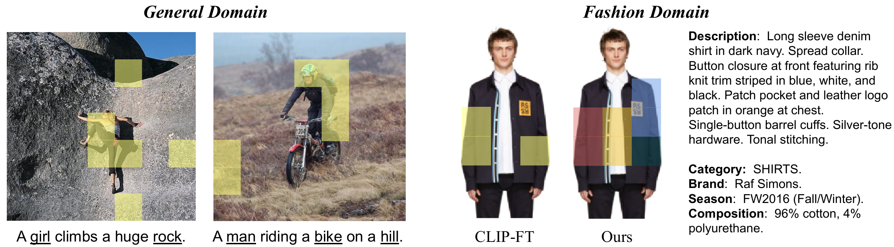
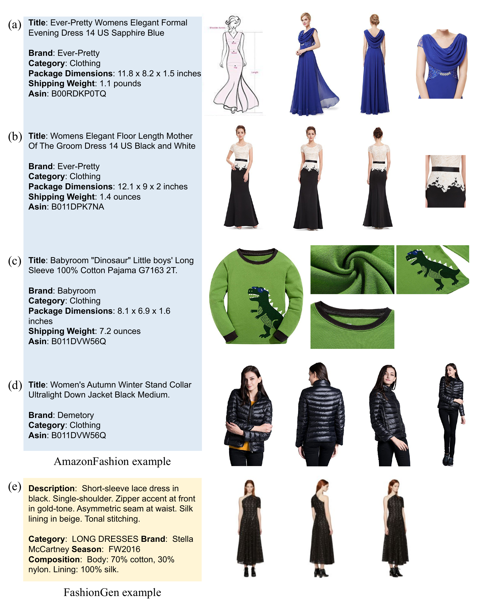
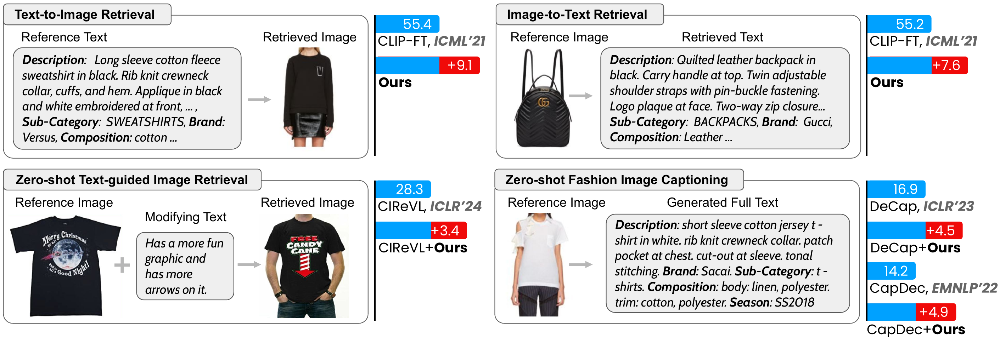
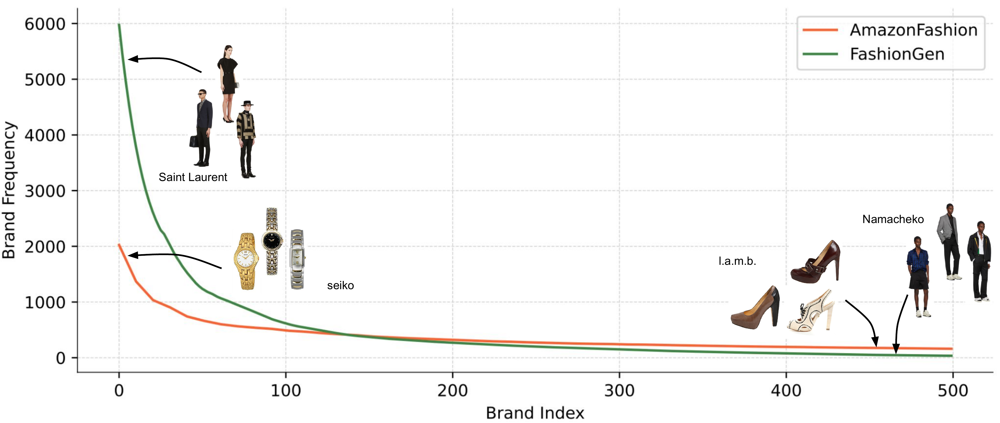
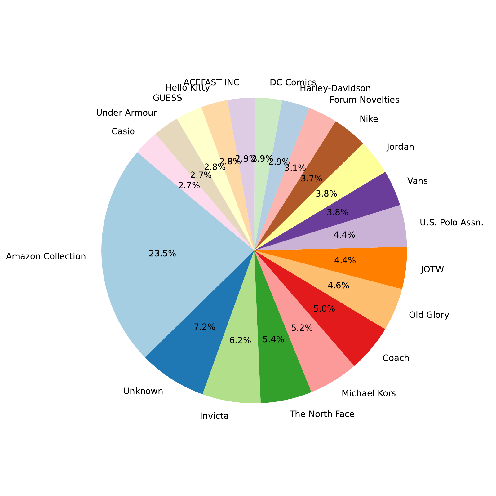
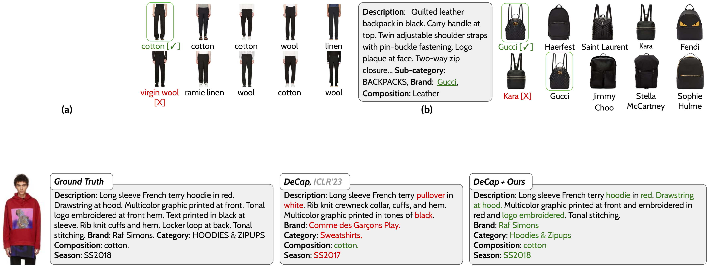
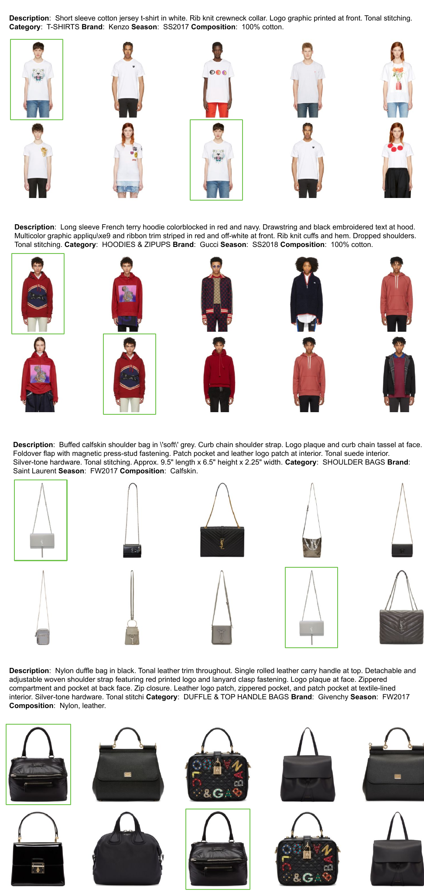
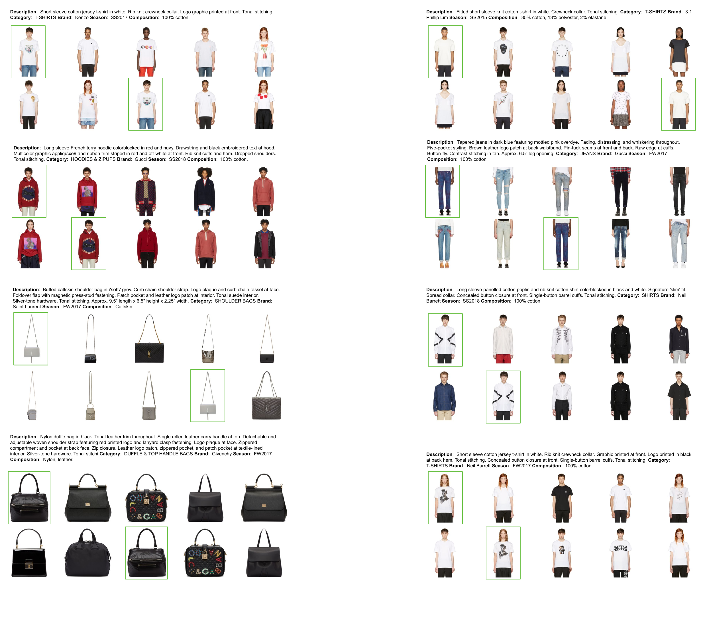

# E²: Easy Regional Contrastive Learning of Expressive Fashion Representations

## Overview

**E²** (Easy Regional Contrastive Learning of Expressive Fashion Representations) is a lightweight vision-language model designed specifically for the fashion domain. By maintaining CLIP's simple architecture while explicitly attending to fashion details through regional contrastive learning, E² achieves superior performance in fashion-related tasks.

### Key Features

- **Lightweight Design**: Only 1.9% additional parameters compared to CLIP
- **Fashion-Focused**: Explicitly attends to critical fashion details (logos, composition, brand, season, sub-category)
- **State-of-the-Art Performance**: Outperforms existing fashion VLMs across multiple benchmarks
- **Easy Integration**: Seamlessly replaces CLIP encoders in existing downstream models

## Architecture

<div align="center">
  
</div>

E² introduces:
- **Selection Tokens**: Identify fashion-relevant image regions
- **Fusion Blocks**: Integrate regional information across network layers
- **Region Contrastive Loss**: Align regional features with corresponding text attributes

## Performance Highlights

<div align="center">
  
</div>

### Cross-Modal Retrieval
- **Text-to-Image**: +9.1 improvement over CLIP-FT
- **Image-to-Text**: +7.6 improvement over CLIP-FT

### Zero-Shot Tasks
When integrated into existing models:
- **Text-Guided Image Retrieval**: +3.4 improvement (with CIReVL)
- **Fashion Image Captioning**: +4.5 improvement (with DeCap)

## Domain Gap Analysis

<div align="center">
  
</div>

**The Challenge**: CLIP, trained on general domain data, often misses critical fashion details:
- General domain: focuses on generic objects ("girl", "rock", "man", "bike", "hill")
- Fashion domain: requires attention to specific attributes (brand, season, composition, sub-category)

**E²'s Solution**: Regional contrastive learning explicitly captures fashion-specific details while maintaining CLIP's architectural simplicity.

## Dataset: AmazonFashion

<div align="center">
  
</div>

We collected a new fashion dataset from Amazon Reviews for comprehensive evaluation:

### Dataset Statistics
<div align="center">
  
</div>

### Brand Distribution
<div align="center">
  
</div>

<div align="center">
  
</div>

**Diversity**: The dataset covers a wide range of brands from high-fashion (Saint Laurent) to consumer brands (Amazon Collection, Invicta, The North Face).

## Qualitative Results

### Attention Visualization
<div align="center">
  
</div>

E² successfully identifies and attends to key fashion attributes:
- **Brand**: Correctly identifies brand logos
- **Season**: Recognizes seasonal indicators (FW2016)
- **Sub-Category**: Distinguishes specific garment types (SHIRTS)
- **Composition**: Identifies material composition (96% cotton, 4% polyurethane)

### Retrieval Examples
<div align="center">
  
</div>

<div align="center">
  
</div>

E² demonstrates accurate retrieval by matching:
- Composition details (cotton vs. wool vs. linen)
- Brand information (Gucci, Kara, etc.)
- Correct vs. incorrect attribute identification

## Citation

If you find this work useful, please cite:
```bibtex
@inproceedings{qi2024e2,
  title={E²: Easy Regional Contrastive Learning of Expressive Fashion Representations},
  author={Qi, Daiqing and Zhao, Handong and Li, Sheng},
  booktitle={38th Conference on Neural Information Processing Systems (NeurIPS 2024)},
  year={2024}
}
```
